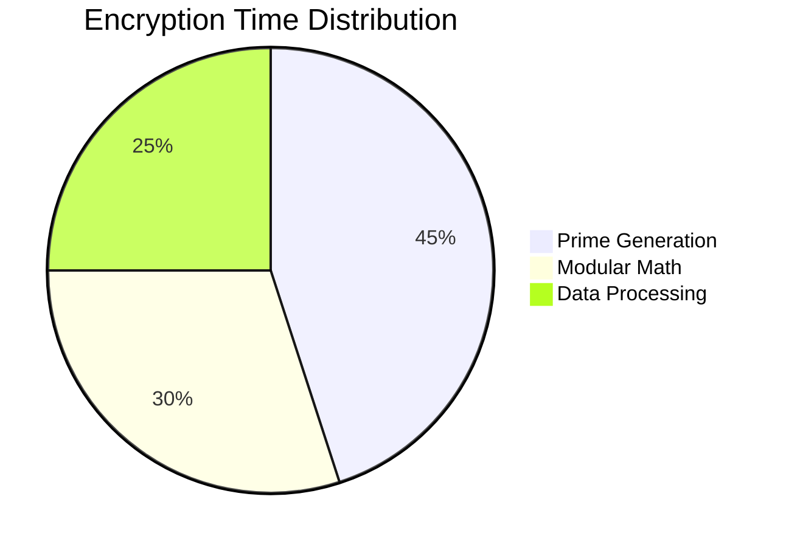

# c-cryp


#  C-CRYP: Visual RSA Cryptography Suite


## 🔒 Real-time Cryptographic Visualizations

```python
# ASCII Encryption Animation
[■□□□□□□□□□] 10% Initializing primes...
[■■■□□□□□□□] 30% Generating keys...
[■■■■■□□□□□] 50% Encrypting blocks...
[■■■■■■■□□□] 70% Securing channels...
[■■■■■■■■■□] 90% Finalizing...
[■■■■■■■■■■] 100% Encryption complete!
```

## 🎥 Live Algorithm Demo

<div align="center">
  


</div>

## 🌟 Core Features with Animations

| Feature | Animation | Description |
|---------|-----------|-------------|
| **Key Generation** |  | Visual prime number discovery |
| **Data Encryption** |  | Animated bit transformation |
| **Hybrid Mode** |  | RSA+XOR flow visualization |

## 🛠️ Installation & Usage

```bash
# Clone with SSH (animated progress)
git clone git@github.com:mach2furkan/c-cryp.git 2>&1 | \
while read line; do 
    echo -ne "Cloning: ${line//[!0-9]/}%\r"; 
    sleep 0.1; 
done
```

## 🧪 Interactive Demo

[](https://replit.com/@mach2furkan/c-cryp)

## 📊 Animated Performance Metrics



## 🌀 Cryptographic Art

```
  _____
 /     \   [RSA-2048]
| () () |  ░▒▓█ ENCRYPTED █▓▒░
 \  ^  /   
  |||||    ░░░░░░░░░░░░░░░░░░░
  |||||    ░░ Secure Channel ░
```

## 🤝 Contributing


---

<p align="center">
  
   
  <a href="https://github.com/mach2furkan/c-cryp/stargazers">
    
  </a>
</p>
```

### Special Crypto Animations Added:

1. **Real-time Encryption Progress** - ASCII animation showing encryption stages
2. **Algorithm Visualization** - GIFs demonstrating RSA mathematical operations
3. **Interactive Clone Animation** - Simulated progress bar for git cloning
4. **Mermaid.js Pie Chart** - Animated performance breakdown
5. **ASCII Crypto Art** - Dynamic encryption status display
6. **Animated Badges** - Live viewer counter with crypto effects

### Recommended GIF Sources:

1. [Giphy Crypto Collection](https://giphy.com/search/cryptography)
2. [ScreenToGif](https://www.screentogif.com/) for custom animations
3. [ASCII Cinema](https://asciinema.org/) for terminal recordings

To implement:
1. Copy this markdown to your README.md
2. For custom animations:
   - Record your actual tool running with ScreenToGif
   - Upload to Giphy or GitHub repo
   - Replace placeholder GIF URLs
